# 📚 Mika Books - Nền Tảng Đọc Sách & Truyện Trực Tuyến

<p align="center">
  
  
  
  
  
</p>

> **Mika Books** là giải pháp ứng dụng di động đọc sách điện tử thế hệ mới, mang đến trải nghiệm đọc mượt mà với giao diện Dark Mode cao cấp, tích hợp hệ thống kinh tế số (nạp xu mở khóa chương VIP), quản lý tủ sách cá nhân và trung tâm quản trị di động (Admin Portal) toàn diện.

---

## 📱 1. PHÂN HỆ FRONTEND MOBILE APP (`fe-mika`) — TÂM ĐIỂM DỰ ÁN

> 👩‍💻 **Frontend Developer & UI/UX Designer:** Nguyễn Thị Yến Thơ  
> ⚡ **Công nghệ chủ đạo:** React Native, Expo SDK, Expo Router, AsyncStorage, Biometrics  
> 💡 **Triết lý phát triển:** *Offline-First, Mobile-Centric, Micro-Interactions & Premium Aesthetics*

Phần Frontend là thành phần cốt lõi và được đầu tư nghiên cứu sâu rộng nhất trong dự án, đảm bảo trải nghiệm tương tác liền mạch, chuẩn mực ứng dụng di động thương mại.

```mermaid
graph TD
    A[Khách / Người Dùng] -->|Vân tay / FaceID| B(Đăng Nhập / Đăng Ký)
    B --> C{Trang Chủ Mika}
    C -->|Tìm kiếm / Thể loại| D[Khám Phá & Sách Mới]
    C -->|Xem chi tiết| E[Chi Tiết Tác Phẩm]
    E -->|Chương Miễn Phí| F[Trình Đọc Sách Tùy Biến Font]
    E -->|Chương VIP| G{Kiểm Tra Số Dư Xu}
    G -->|Đủ Xu| F
    G -->|Thiếu Xu| H[Ví Xu & Thanh Toán MoMo/VNPay/QR]
    H -->|Cộng Xu Thành Công| F
    E -->|Yêu thích| I[Tủ Sách Cá Nhân Offline]
    F -->|Trích dẫn tâm đắc| J[Thiết Kế Thẻ Chia Sẻ MXH]
    B -->|Tài khoản Quản Trị| K[🛡️ Admin Mobile Portal]
```



---

### 🎨 1.1. Thiết Kế Giao Diện & Design System Độc Quyền
Giao diện được xây dựng từ hệ thống Component độc lập (`components/UI.js`), tuân thủ nghiêm ngặt nguyên lý thị giác dành cho ứng dụng đọc sách ban đêm:
- **Sắc thái Dark Mode sang trọng:** Sử dụng nền than sâu (`#0a0d14`), điểm nhấn tím hoàng gia (`#a07cf0`) và ánh vàng kim (`#f59e0b`).
- **Hiệu ứng Glassmorphism:** Các thẻ sách (`BookCard`), hộp thông tin sử dụng nền kính mờ đa lớp với viền neon tinh xảo.
- **Floating Bottom Navigation:** Thanh điều hướng bo góc nổi đáy màn hình, thuận tiện thao tác một tay.
- **Trải nghiệm đọc công thái học (Ergonomics):** Cho phép phóng to/thu nhỏ cỡ chữ theo sở thích mắt người đọc.

---

### 📋 1.2. Danh Sách Màn Hình & Tính Năng Chi Tiết (15+ Màn hình hoàn thiện)

| STT | Màn hình | Đường dẫn File | Tính năng chi tiết |
| :---: | :--- | :--- | :--- |
| **1** | **Xác thực sinh trắc học** | `app/dang-nhap.jsx`, `dang-ky.jsx` | Đăng nhập/Đăng ký bảo mật cao bằng **Vân tay & FaceID** (`biometricService`). |
| **2** | **Trang chủ tương tác** | `app/trang-chu.jsx` | Slider biểu ngữ động, đề xuất thông minh, live-search thời gian thực, lọc thể loại tức thì. |
| **3** | **Khám phá & Nổi bật** | `app/noi-bat.jsx` | Bố cục lưới Grid 2 cột tiêu chuẩn thương mại, sắp xếp theo độ hot và số sao đánh giá. |
| **4** | **Sách mới phát hành** | `app/sach-moi.jsx` | Cập nhật theo thời gian thực các đầu sách và chương vừa xuất bản. |
| **5** | **Chi tiết truyện** | `app/chi-tiet.jsx` | Bìa sách nghệ thuật, tóm tắt tác phẩm, phân chia rõ ràng danh sách chương Thường & VIP. |
| **6** | **Trình đọc sách** | `app/doc-sach.jsx` | Đọc toàn màn hình, chuyển chương mượt mà, lưu vị trí đọc dở, tự cảnh báo khi gặp chương khóa. |
| **7** | **Tủ sách & Yêu thích** | `app/truyen-da-luu.jsx` | Quản lý kho sách cá nhân, hỗ trợ đọc và xem ngoại tuyến qua `AsyncStorage`. |
| **8** | **Cửa hàng Xu** | `app/nap-xu.jsx` | Hiển thị các gói nạp xu kèm % khuyến mãi hấp dẫn. |
| **9** | **Cổng thanh toán** | `app/thanh-toan.jsx` | Mô phỏng cổng giao dịch đa phương thức: Ví MoMo, Cổng VNPay, Quét mã VietQR. |
| **10**| **Thanh toán thành công** | `app/thanh-toan-thanh-cong.jsx` | Hiệu ứng chúc mừng, tự động cập nhật số dư ví tức thì và đưa người đọc quay lại trang sách. |
| **11**| **Chia sẻ thẻ Quote** | `app/chia-se.jsx`, `xem-truoc-chia-se.jsx` | Trích xuất câu văn hay, tự động render ảnh trích dẫn chuẩn kích thước Story Facebook/Instagram. |
| **12**| **Tài khoản cá nhân** | `app/tai-khoan.jsx` | Quản lý thông tin, avatar, số dư xu ví, lịch sử giao dịch và chuyển đổi chủ đề. |
| **13**| **🛡️ Phân hệ Quản trị** | `app/admin/*` | **Admin Mobile Portal**: Thêm/sửa truyện, quản lý chương, duyệt tin tức, xem biểu đồ doanh thu. |

---

### 💎 1.3. Điểm Sáng Kỹ Thuật (Frontend Technical Highlights)
1. **Kiến trúc Repository Pattern:** Toàn bộ lệnh tương tác dữ liệu được module hóa (`services/repositories/*`), tách biệt hoàn toàn giao diện khỏi logic dữ liệu.
2. **Cơ chế Fallback Linh Hoạt (Offline-First):**
   - Ứng dụng tự động kết nối API khi có mạng.
   - **Tự động chuyển sang Local Mock Data** khi server offline hoặc mất mạng, giúp ban giám khảo / người test trải nghiệm đầy đủ tính năng mà không bị lỗi đứt gãy.
3. **Dynamic Dev IP Detection (`constants/api.js`):** Tự động phát hiện địa chỉ IP mạng nội bộ của máy chủ phát triển, loại bỏ hoàn toàn lỗi gán cứng `localhost` khi chạy thử trên điện thoại thật qua Expo Go.
4. **Hệ thống thông báo đẩy (Notifications):** Tích hợp thông báo nhắc nhở đọc sách và thông báo giao dịch thành công.

---

## 🗂️ 2. TỔ CHỨC CẤU TRÚC THƯ MỤC (MONOREPO)

```text
mika-project/
├── 📁 fe-mika/                  # ⭐ [TRỌNG TÂM] Ứng dụng Mobile React Native Expo
│   ├── app/                    # 15+ Màn hình chức năng & Expo File-based Routing
│   │   ├── admin/              # Portal Quản trị viên (Admin)
│   │   ├── (tabs)/             # Điều hướng tab chính
│   │   └── ...
│   ├── components/             # Thư viện UI & Design System dùng chung
│   ├── constants/              # Cấu hình API, theme màu sắc, style tokens
│   ├── hooks/                  # Custom React Hooks (Theme, LocalBooks,...)
│   └── services/               # Repositories, Sinh trắc học, Storage, Notifications
│
├── 📁 backend-mika/             # Dịch vụ Backend API (Django REST Framework)
│   ├── api/                    # Quản lý Serializers, Views, REST Endpoints
│   └── backend/                # Cài đặt hệ thống, định tuyến URL
│
├── 📁 database/                 # Cơ sở dữ liệu quan hệ
│   └── db_mika_books.sql       # Script MySQL khởi tạo 9 bảng dữ liệu
│
└── 📄 README.md                # Tài liệu kỹ thuật dự án
```

---

## ⚙️ 3. DỊCH VỤ BACKEND & CƠ SỞ DỮ LIỆU HỖ TRỢ

Phần Backend và Database đóng vai trò là tầng dịch vụ nền tảng cung cấp dữ liệu ổn định cho Mobile Frontend:

- **Backend (`backend-mika`):** Viết bằng Python Django 6.0 + Django REST Framework (DRF), cung cấp các API xác thực băm mật khẩu, truy vấn danh mục truyện và nạp xu.
- **Database (`database`):** MySQL gồm 9 bảng quan hệ chuẩn hóa (`NguoiDung`, `Sach`, `Chuong`, `TheLoai`, `GoiNapXu`, `LichSuGiaoDich`,...).

---

## 🚀 4. HƯỚNG DẪN KHỞI CHẠY ỨNG DỤNG NHANH

### Cách nhanh nhất: Chạy trực tiếp Frontend Mobile (Không cần cài đặt Backend)
Nhờ kiến trúc Offline-First, bạn có thể kiểm thử toàn bộ giao diện và luồng ứng dụng chỉ bằng 2 bước:

```bash
# 1. Truy cập thư mục Frontend
cd fe-mika

# 2. Cài đặt thư viện
npm install

# 3. Chạy ứng dụng Expo
npx expo start
```
> 📲 **Cách xem:** Quét mã QR xuất hiện trên màn hình bằng ứng dụng **Expo Go** (trên điện thoại Android / iPhone) hoặc nhấn phím `w` để mở giao diện Web.

---

### Chạy kèm Backend & Database (Tùy chọn)
Nếu muốn chạy toàn bộ hệ thống API cục bộ:
1. Tạo Database `db_mika_books` trong MySQL và import file `database/db_mika_books.sql`.
2. Khởi động máy chủ Django:
   ```bash
   cd backend-mika
   pip install -r requirements.txt
   python manage.py runserver 0.0.0.0:8000
   ```

---

## 🔑 5. TÀI KHOẢN TRẢI NGHIỆM HỆ THỐNG

| Đối tượng | Email | Mật khẩu | Tính năng thử nghiệm |
| :--- | :--- | :--- | :--- |
| **Độc giả mẫu** | `user@mika.vn` | `12345678` | Trải nghiệm toàn bộ luồng Đọc sách, Mở khóa VIP, Nạp xu MoMo/VNPay, Lưu tủ sách |
| **Quản trị viên** | `admin@mika.vn` | `12345678` | Truy cập **Admin Mobile Portal** quản lý truyện, chương, người dùng |

---

<p align="center">
  <b>Mika Books Project</b> • Phát triển với sự tỉ mỉ trong từng chi tiết giao diện và trải nghiệm người dùng di động.
</p>
